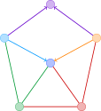

[](https://malte311.github.io/PdagExtendability/)

# PdagExtendability 
This repository contains a benchmarking framework for the extendability of
(causal) graphs.
The benchmarking framework contains efficient algorithms for extending
(causal) graphs and more than 1000 exemplary input graph instances.

More precisely, algorithms solving the following two problems are provided:
1. Given any partially directed graph _G_, compute a consistent DAG extension
for _G_ if _G_ admits such an extension, otherwise return a negative answer
(Extension Problem).
2. Given any partially directed graph _G_, compute the set of **all** consistent
DAG extensions for _G_ (Enumeration Problem).

## Usage
In order to run the benchmarks, download the repository first.
The benchmarks can be started directly from the terminal via
```bash
julia run.jl "../configs/config.json"
```
Alternatively, you can start a Docker container via `./run.sh` and
run the same command inside of the Docker container (this allows to
execute the code without installing Julia or any of the dependencies on
your machine).

See also the [documentation](https://malte311.github.io/PdagExtendability/getting_started/)
for more detailed information on how to adjust the configuration for a run.

## References
Many of the implemented algorithms are from the following papers:

> D. Dor, M. Tarsi (1992).
> A simple algorithm to construct a consistent extension of a partially oriented graph.
> Technicial Report R-185, Cognitive Systems Laboratory, UCLA.

> M. Wienöbst, M. Bannach, M. Liśkiewicz (2021).
> Extendability of Causal Graphical Models: Algorithms and Computational Complexity.
> 37th Conference on Uncertainty in Artificial Intelligence, 2021 (UAI 2021).

## Development with Docker
The whole software is wrapped inside a Docker container. Thus, it is not even
necessary to have Julia installed on your system. Using Docker, simply run
`./run.sh` to start the system. Edit the source files as you like and execute
them directly in the shell provided by Docker.

In case the [Dockerfile](https://github.com/Malte311/PdagExtendability/blob/master/Dockerfile)
is edited, you can run `./run.sh b` to rebuild the Docker container
before starting it.